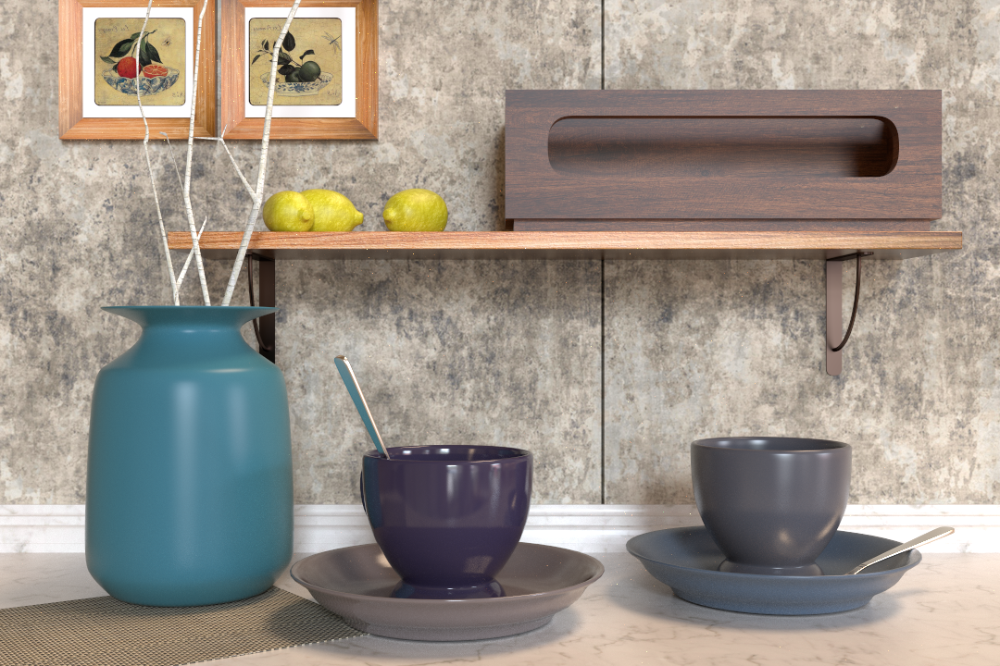
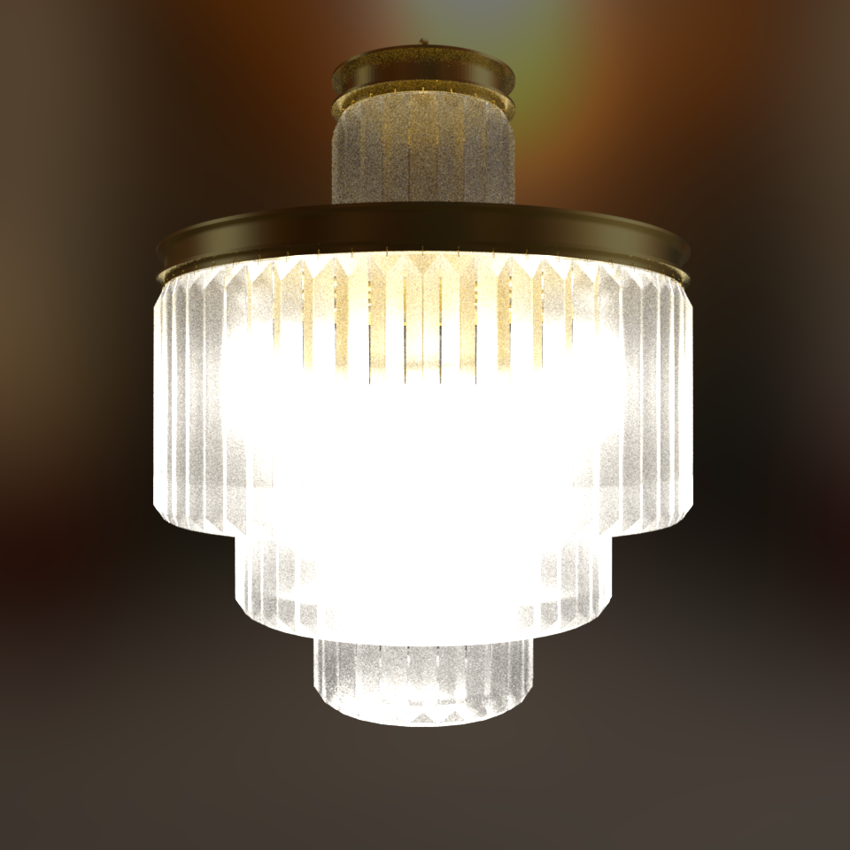
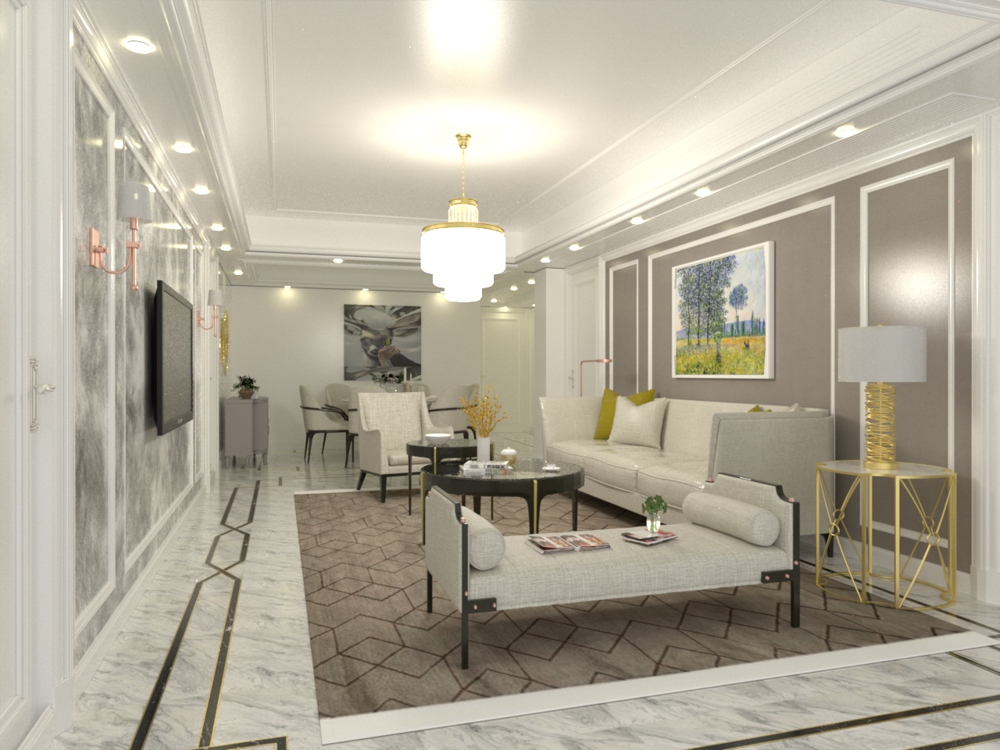
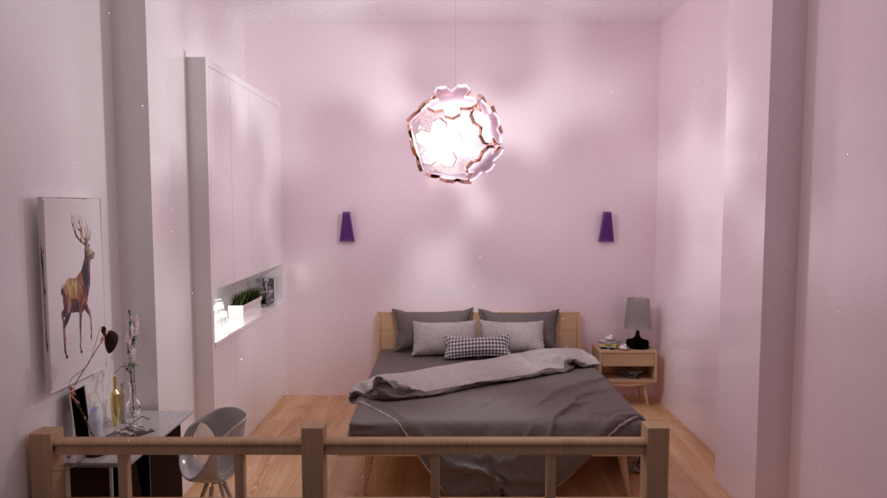
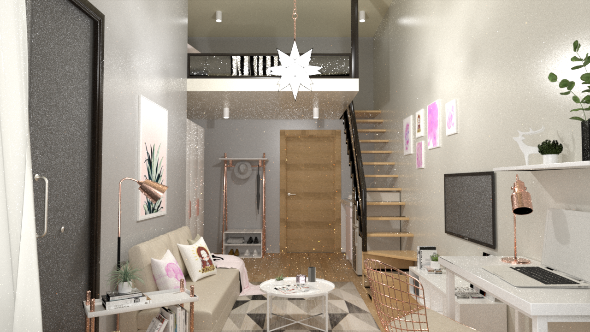
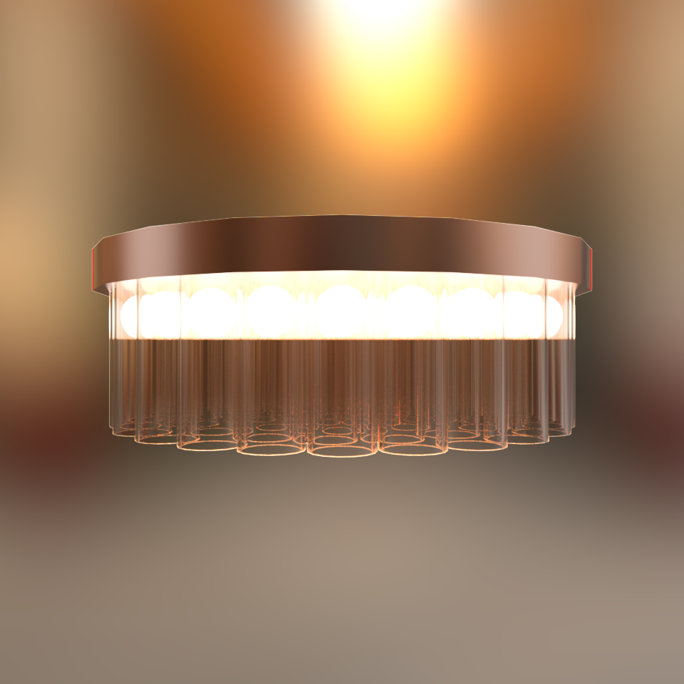
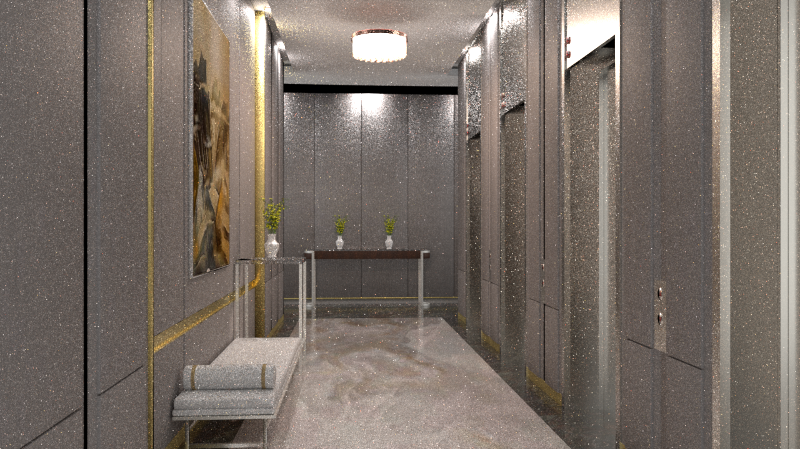
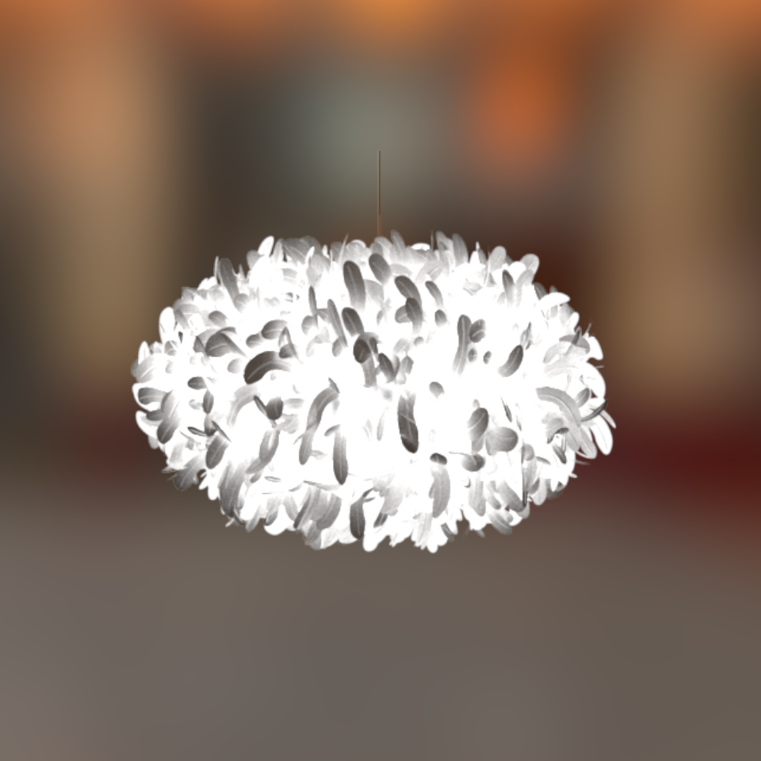
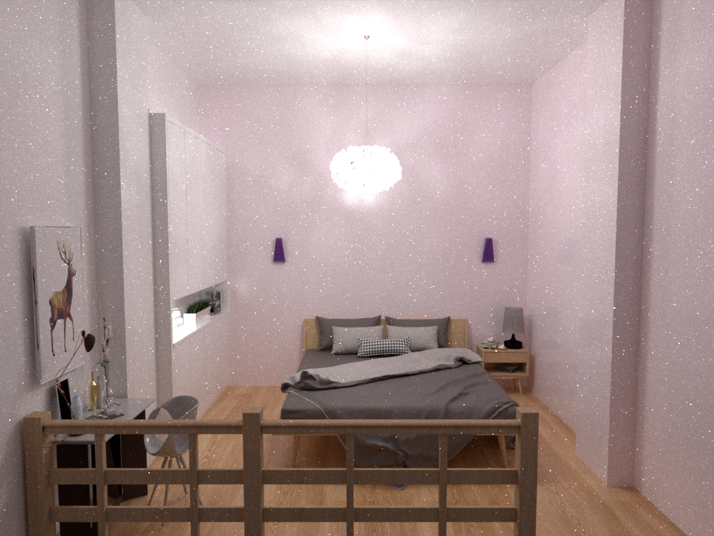

# Mitsuba Scenes

Welcome! Here are several rendering scenes for [Mitsuba renderer](https://www.mitsuba-renderer.org/)!

### [Layered Kitchen](layered_kitchen) 
From paper: BSDF Importance Baking: A Lightweight Neural Solution to Importance Sampling General Parametric BSDFs


### [Leaves Status](leaves_status) 
From paper: BSDF Importance Baking: A Lightweight Neural Solution to Importance Sampling General Parametric BSDFs


### [Green Window](GreenWindow) 


### [Glass Chandelier livingroom](glassChandelier_livingroom) 
From paper: Neural complex luminaires: representation and rendering



### [Flower Bedroom](flower_bedroom) 
From paper: Neural complex luminaires: representation and rendering



### [StarLight Loftroom](starLight_loftroom) 
From paper: Neural complex luminaires: representation and rendering



### [Statler Elevatorroom](statler_elevatorroom) 
From paper: Neural complex luminaires: representation and rendering




### [Bedroom Featherlum](bedroom_featherlum) 
From paper: Neural complex luminaires: representation and rendering



## Note
I would appreciate it if you cite this when using the scenes:

```bibtex
@misc{mitsuba_scenes,
   author = {Yaoyi Bai},
   year = {2025},
   note = {https://github.com/VElysianP/mitsuba_scenes},
   title = {Rendering Resources}
}
